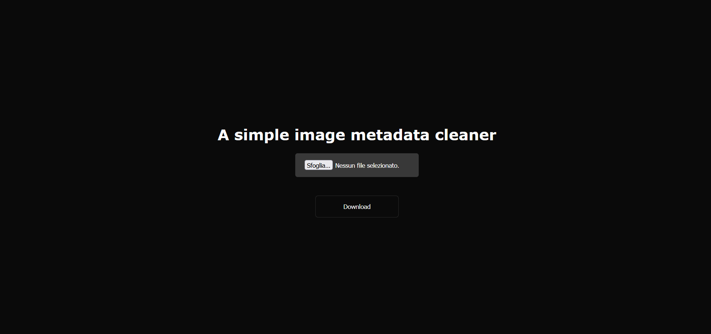

# Image Metadata Cleaner

## Overview
This open-source project is a privacy-focused image metadata cleaner built using HTML, CSS, and JavaScript. The website allows users to clean metadata on the client-side without uploading images to a server, ensuring privacy, speed, and quality.

## Features
- Clean image metadata locally
- Privacy-focused design
- Fast and efficient processing
- User-friendly interface

## Technologies Used
- HTML
- CSS
- JavaScript

## How to Use
1. Clone the repository to your local machine.
2. Open the `index.html` file in your web browser.
3. Upload the image you want to clean metadata for.
4. Click the clean metadata button to process the image locally.
5. Download the cleaned image with metadata removed.

## Contributing
We welcome contributions to improve this project. Feel free to fork the repository and submit a pull request with your enhancements.

## License
This project is licensed under the MIT License - see the [LICENSE](LICENSE) file for details.
